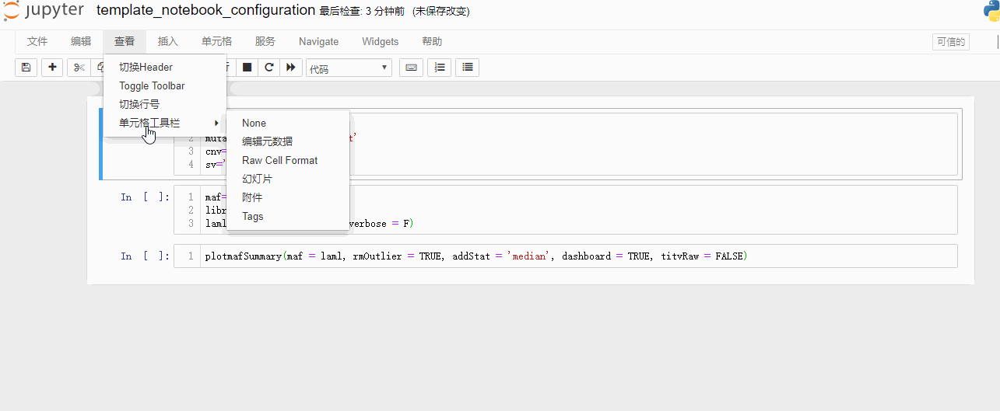
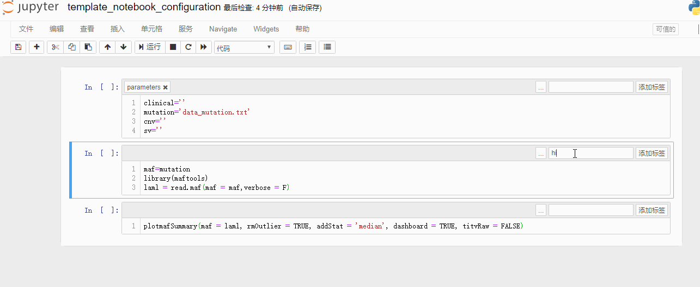
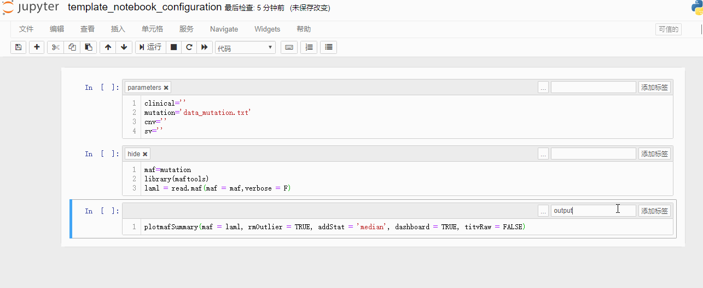
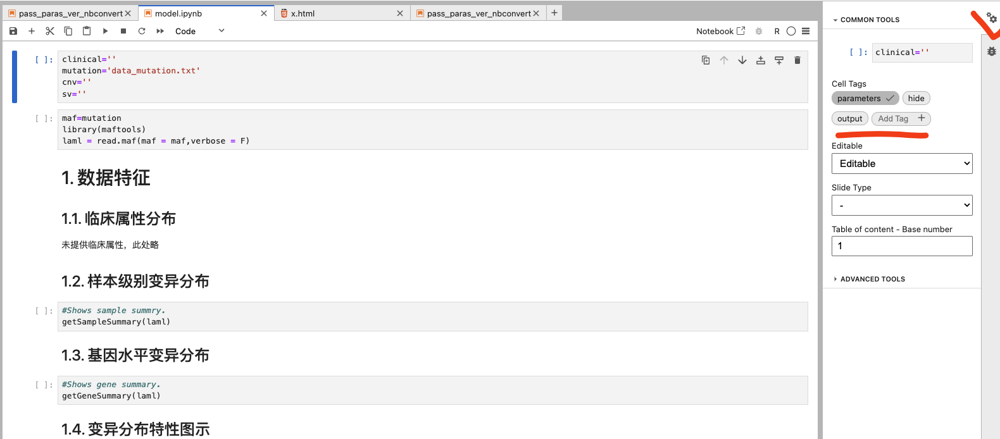

# jupyter_web_report
jwr, short for jupyter_web_report, is a command line interface tool for using jupyter`s ipynb file as a reusable template to generate analysis report with new data source.

It provides properties such as:
- passing command line parameters to notebook, 
- executing notebooks, 
- jupyter cell level output controlling.

It supports all the kernals like IR,Ipython, etc.

## Installation

### From pip
```
pip install jupyter_web_report
```

### From github
```
git clone https://github.com/JaylanLiu/jupyter-web-report
cd jupyter-web-report
python setup.py install
```

## Usage 

### Template notebook configuration
In Jupyter notebook, tags can be added as following:


Cell with a parameters tag will recieve the arguments from jwr. Parameters cell would not present in the output html. 

Cell with a hide tag would be executed but not present in the output html.

Cell with a output tage would be executed and only present the 'Out' without the 'In' structure in the output html.

Untaged cell would be executed and present both 'In' and 'Out' structures in the output html as default manner.


In Jupyter lab, tags can be added in the right pallete.



### parameterize and execution
```
$jwr -h
usage: jwr [-h] -i IPYNB [-o OUTPUT] [-t TIMEOUT] [--dryrun]

jupyter-web-report

optional arguments:
  -h, --help            show this help message and exit
  -i IPYNB, --ipynb IPYNB
                        path to ipynb template
  -o OUTPUT, --output OUTPUT
                        path to output executed ipynb
  -t TIMEOUT, --timeout TIMEOUT
                        time for ipynb execuation
  --dryrun              skip execution, generate report directly from input
                        notebook
```
'-i' specifies the configured template ipynb file. '-o' can be a file name which ends with '.html' or '.ipynb', output would be consistent to the suffix. if '-o' is not specified, then the output goes to stdout as html. '-t' specifies the time limit for notebook execution, 6000 sec for default, '--dryrun' mode skip execution, generate report directly from input notebook.

Any parameters can be passed in the template ipynb notebook\`s parameters cell using a `--key value` format attach to the command.

## Example
```
$jwr -i example/model.ipynb -o x.html --mutation example/data_mutation.txt 
2024-09-13 11:41:37,243 - jupyter_web_report.py[line:23] - INFO: loading template ipynb successfully
2024-09-13 11:41:37,244 - jupyter_web_report.py[line:26] - INFO: passed in args:{'mutation': 'example/data_mutation.txt'}
2024-09-13 11:41:37,244 - jupyter_web_report.py[line:38] - INFO: args in ipynb parameters cell{'clinical': "''", 'mutation': "'data_mutation.txt'", 'cnv': "''", 'sv': "''"}
2024-09-13 11:41:37,244 - jupyter_web_report.py[line:39] - INFO: used args{'mutation'}
2024-09-13 11:41:37,244 - jupyter_web_report.py[line:52] - INFO: parameterizing successfully
2024-09-13 11:41:37,244 - jupyter_web_report.py[line:64] - INFO: starting executing
2024-09-13 11:41:40,356 - jupyter_web_report.py[line:68] - INFO: finished execution
2024-09-13 11:41:40,654 - jupyter_web_report.py[line:84] - INFO: output successfully
```
If you just need to transfer input notebook file to html report without re-execute the code, add `--dryrun` argument.
```
$jwr -i test.ipynb -o tt.html --dryrun
2020-08-21 10:26:47,474 - jupyter_web_report.py[line:21] - INFO: loading template ipynb successfully
2020-08-21 10:26:47,475 - jupyter_web_report.py[line:24] - INFO: passed in args:{}
2020-08-21 10:26:47,475 - jupyter_web_report.py[line:50] - INFO: parameterizing successfully
2020-08-21 10:26:48,534 - jupyter_web_report.py[line:76] - INFO: output successfully
```